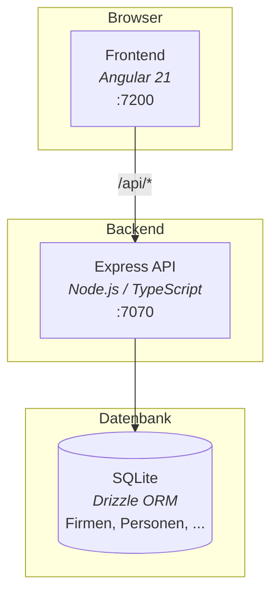

# AI Coding Lab — CRM Demo

> Ein Testprojekt des [atra.consulting](https://atra.consulting/) **AI Coding Lab**.
> Ziel ist es, anhand einer realistischen Full-Stack-Anwendung zu zeigen, wie AI-gestütztes Coding in der Praxis funktioniert.

## Tech-Stack

| Schicht | Technologie |
|---------|-------------|
| Backend | Node.js · TypeScript · Express · Drizzle ORM |
| Frontend | Angular 21 · Bootstrap 5 · SCSS |
| Datenbank | SQLite (file-based, via better-sqlite3) |
| Auth | Session-basiert (bcrypt + express-session) |

## Architektur



Detaillierte Architektur-Dokumentation: [docs/architecture.md](docs/architecture.md)

## Voraussetzungen

**Node.js 20.19 oder neuer** (Voraussetzung für Angular 21). npm wird mit Node.js mitgeliefert.

### Node.js installieren

#### macOS

```bash
# Option 1: Homebrew (empfohlen)
brew install node@22

# Option 2: nvm (Node Version Manager)
curl -o- https://raw.githubusercontent.com/nvm-sh/nvm/v0.40.3/install.sh | bash
nvm install 22
```

#### Windows

```powershell
# Option 1: Offizielle Installer von https://nodejs.org/ herunterladen und ausführen

# Option 2: winget
winget install OpenJS.NodeJS.LTS

# Option 3: nvm-windows (https://github.com/coreybutler/nvm-windows)
nvm install 22
nvm use 22
```

#### Linux (Ubuntu/Debian)

```bash
# Option 1: NodeSource-Repository (empfohlen)
curl -fsSL https://deb.nodesource.com/setup_22.x | sudo -E bash -
sudo apt-get install -y nodejs

# Option 2: nvm (Node Version Manager)
curl -o- https://raw.githubusercontent.com/nvm-sh/nvm/v0.40.3/install.sh | bash
nvm install 22
```

#### Linux (Fedora/RHEL)

```bash
# Option 1: NodeSource-Repository
curl -fsSL https://rpm.nodesource.com/setup_22.x | sudo bash -
sudo dnf install -y nodejs

# Option 2: nvm
curl -o- https://raw.githubusercontent.com/nvm-sh/nvm/v0.40.3/install.sh | bash
nvm install 22
```

### Version prüfen

```bash
node --version   # Muss v20.19.0 oder neuer sein
npm --version    # Wird mit Node.js mitgeliefert
```

## Schnellstart

```bash
./start.sh           # macOS / Linux
start.bat            # Windows
```

Das Skript installiert bei Bedarf die npm-Abhängigkeiten, startet Backend und Frontend und wartet, bis beide bereit sind.

| URL | Beschreibung |
|-----|-------------|
| http://localhost:7200 | Frontend |
| http://localhost:7070 | Backend API |

### Demo-Login

Drei vorkonfigurierte Benutzer stehen zur Verfügung:

| Benutzername | Passwort | Rolle |
|--------------|----------|-------|
| `admin` | `admin123` | ADMIN |
| `user` | `test123` | USER |
| `demo` | `demo1234` | ADMIN |

### Startskript-Flags

| Flag | Beschreibung |
|------|-------------|
| `--reset-db` | SQLite-Datenbank löschen (wird beim nächsten Start neu aufgebaut) |

```bash
./start.sh              # Standardstart
./start.sh --reset-db   # Datenbank zurücksetzen
```

### Einzeln starten

```bash
# Backend (Port 7070, Hot Reload via tsx --watch)
cd backend && npx tsx --watch src/index.ts

# Frontend (Port 7200, Proxy leitet /api/* an Backend weiter)
cd frontend && npx ng serve --port 7200 --proxy-config proxy.conf.json
```

## Projektstruktur

```
├── backend/            Node.js/TypeScript Backend (Express + Drizzle ORM)
│   ├── src/
│   │   ├── config/     Datenbank, Migration, Benutzer
│   │   ├── db/         Drizzle-Schema
│   │   ├── middleware/  Auth, Error Handler
│   │   ├── routes/     REST-Endpunkte
│   │   ├── seed/       Testdaten
│   │   └── services/   Business-Logik
│   └── data/           SQLite-Datenbankdatei (gitignored)
├── frontend/           Angular 21 SPA
│   └── src/app/
│       ├── core/       Guards, Interceptors, Services
│       ├── features/   Feature-Komponenten
│       ├── layout/     Sidebar, Header
│       └── shared/     Gemeinsame Komponenten
├── docs/
│   ├── specs/          Systemspezifikationen
│   ├── prds/           Product Requirement Documents
│   ├── adr/            Architecture Decision Records
│   └── uxdr/           UX Design Records
├── start.sh            Startskript (macOS/Linux)
├── start.bat           Startskript (Windows)
└── CLAUDE.md           Anweisungen für AI-Coding-Assistenten
```

## Domänenmodell

Die Anwendung bildet ein deutschsprachiges CRM ab:

**Stammdaten** — Firma, Person, Abteilung, Adresse
**Finanzen & Vertrieb** — Gehalt, Aktivitaet, Vertrag, Chance

## Features

- **Chancen-Pipeline** — Kanban-Board mit Drag & Drop und paginierte Listen-Ansicht
- **Dashboard** — Konfigurierbares Dashboard mit Widgets
- **Auswertungen** — Pipeline-Dashboard und Report Builder mit dynamischen Abfragen
- **Feedback** — Nutzerfeedback per QR-Code
- **Session-Authentifizierung** — bcrypt-Passwörter mit rollenbasierter Zugriffskontrolle

## Backend-Patterns

Jede CRM-Entität folgt dem gleichen Muster:

```
Drizzle Schema → Service → Express Route (mit Auth-Middleware)
```

REST-Endpunkte unter `/api/<plural>` mit Pagination (`page`, `size`, `sort`).

## Frontend-Patterns

Angular 21 Standalone-Komponenten mit:
- Lazy-loaded Feature-Routen
- Reactive Forms
- NgbPagination (1-indexed → 0-indexed Konvertierung)
- CDK Drag & Drop für das Kanban-Board
- AG Grid für Datentabellen
- Chart.js für Diagramme

## Lizenz

Internes Schulungsprojekt von [atra.consulting](https://atra.consulting/).
