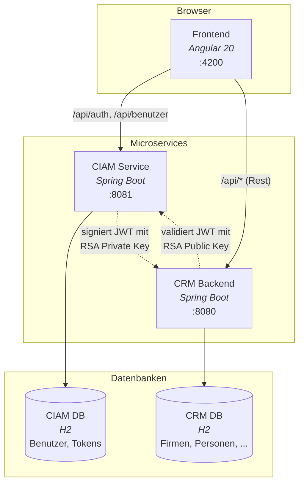

# AI Coding Lab — CRM Demo

> Ein Testprojekt des [atra.consulting](https://atra.consulting/) **AI Coding Lab**.
> Ziel ist es, anhand einer realistischen Full-Stack-Anwendung zu zeigen, wie AI-gestütztes Coding in der Praxis funktioniert.

## Tech-Stack

| Schicht  | Technologie |
|----------|-------------|
| CIAM Service | Spring Boot 3.5.3 · Java 21 · RS256 JWT |
| CRM Backend | Spring Boot 3.5.3 · Java 21 · Resource Server |
| Frontend | Angular 20 · Bootstrap 5 · SCSS |
| Datenbanken | H2 (file-based, je eine pro Service) |

## Architektur



Detaillierte Architektur-Dokumentation: [docs/architecture.md](docs/architecture.md)

## Schnellstart

```bash
# Voraussetzungen: Java 21, Node.js, Maven
./start.sh
```

Das Skript startet CIAM (Port 8081), CRM-Backend (Port 8080) und Frontend (Port 4200) und wartet, bis alle Services bereit sind.
Im Demo-Modus (Standard) wird auf der Login-Seite ein Button **„Demodaten ausfüllen"** angezeigt, der Benutzername und Passwort automatisch einträgt.

| URL | Beschreibung |
|-----|-------------|
| http://localhost:4200 | Frontend |
| http://localhost:8080 | CRM Backend API |
| http://localhost:8081 | CIAM Service |
| http://localhost:8080/h2-console | CRM H2-Konsole |
| http://localhost:8081/h2-console | CIAM H2-Konsole |

### Demo-Login

Im Demo-Modus steht ein vorkonfigurierter Benutzer zur Verfügung:

| Benutzername | Passwort | Rolle |
|--------------|----------|-------|
| `demo` | `demo1234` | ADMIN |

### Startskript-Flags

| Flag | Beschreibung |
|------|-------------|
| `--reset-db` | Beide H2-Datenbanken löschen (werden beim nächsten Start neu aufgebaut) |
| `--no-demo` | Demo-Modus deaktivieren (versteckt den Demo-Button auf der Login-Seite) |

```bash
./start.sh              # Standardstart mit Demo-Modus
./start.sh --reset-db   # Datenbanken zurücksetzen
./start.sh --no-demo    # Ohne Demo-Modus
```

### Einzeln starten

```bash
# CIAM Service (muss zuerst starten — generiert RSA Keys)
cd ciam && mvn spring-boot:run

# CRM Backend (braucht RSA Public Key aus ciam/keys/)
cd backend && mvn spring-boot:run

# Frontend (Proxy routet an CIAM + CRM)
cd frontend && npx ng serve --proxy-config proxy.conf.json
```

## Projektstruktur

```
├── ciam/             CIAM Microservice (Auth, JWT, Benutzerverwaltung)
│   ├── keys/         RSA Key Pair (gitignored, auto-generiert)
│   └── data/         H2-Datenbankdateien (gitignored)
├── backend/          CRM Backend (Resource Server)
│   └── data/         H2-Datenbankdateien (gitignored)
├── frontend/         Angular SPA
├── docs/
│   ├── architecture.md  Systemarchitektur mit Mermaid-Diagrammen
│   ├── adr/          Architecture Decision Records
│   ├── prds/         Product Requirement Documents
│   └── uxdr/         UX Design Records
├── start.sh          Full-Stack-Startskript (alle 3 Services)
└── CLAUDE.md         Anweisungen für AI-Coding-Assistenten
```

## Domänenmodell

Die Anwendung bildet ein deutschsprachiges CRM ab:

**Stammdaten** — Firma, Person, Abteilung, Adresse
**Finanzen & Vertrieb** — Gehalt, Aktivitaet, Vertrag, Chance

## Features

- **Chancen-Pipeline** — Kanban-Board mit Drag & Drop und paginierte Listen-Ansicht
- **Dashboard** — Konfigurierbares Dashboard mit Widgets
- **Auswertungen** — Pipeline-Dashboard und Report Builder mit dynamischen Abfragen
- **Benutzerverwaltung** — CIAM-Microservice mit Rollen, Permissions und Demo-Modus
- **JWT-Authentifizierung** — RS256-signierte Tokens mit rollenbasierter Zugriffskontrolle

## Backend-Patterns

Jede CRM-Entität folgt dem gleichen Muster:

```
Entity → DTO + CreateDTO → Mapper → Repository → Service → Controller
```

REST-Endpunkte unter `/api/<plural>` mit Pagination (`page`, `size`, `sort`).

## Frontend-Patterns

Angular 20 Standalone-Komponenten mit:
- Lazy-loaded Feature-Routen
- Reactive Forms
- NgbPagination (1-indexed → 0-indexed Konvertierung)
- CDK Drag & Drop für das Kanban-Board

## Lizenz

Internes Schulungsprojekt von [atra.consulting](https://atra.consulting/).
