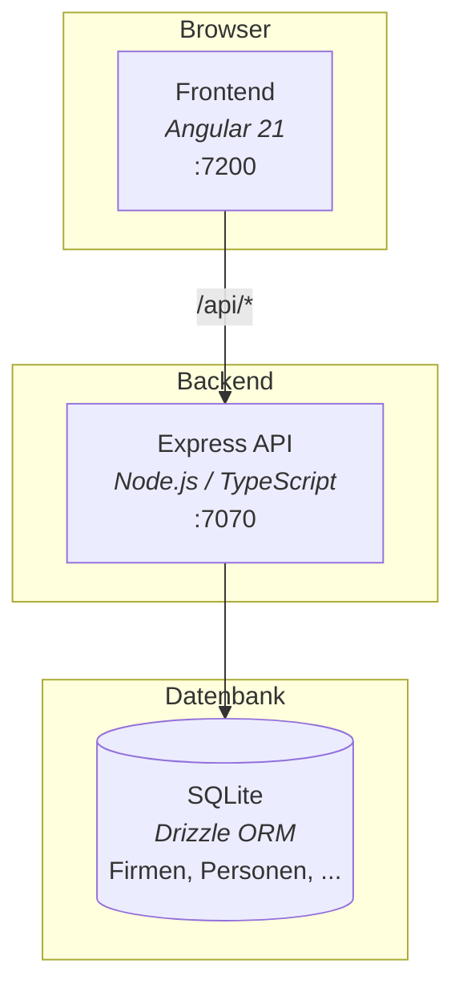

<p align="center">
  <a href="https://atra.consulting/">
    
  </a>
</p>

<h1 align="center">AI Coding Lab — CRM Demo</h1>

<p align="center">
  <em>Eine produktionsnahe Full-Stack-Anwendung des <a href="https://atra.consulting/">atra.consulting</a> <strong>AI Coding Lab</strong> —<br>
  entstanden, um zu zeigen, wie AI-gestützte Softwareentwicklung in der Praxis funktioniert.</em>
</p>

<p align="center">
  <a href="LICENSE"></a>
  
  
  
  
</p>

> **Erstmal hier starten:** Vor dem ersten Start bitte **[SETUP.md](SETUP.md)** lesen — dort steht die komplette Installationsanleitung (Node.js, Claude Code, IDE, Markdown-Viewer).

---

## Inhalt

- [Architektur](#architektur)
- [Schnellstart](#schnellstart)
- [Demo-Login](#demo-login)
- [Features](#features)
- [Tech-Stack](#tech-stack)
- [Weiterführende Dokumentation](#weiterführende-dokumentation)
- [Lizenz](#lizenz)

---

## Architektur



Detaillierte Architektur-Dokumentation: **[docs/architecture.md](docs/architecture.md)**

---

## Schnellstart

> **Voraussetzungen:** Node.js 20.19+ — vollständige Anleitung in **[SETUP.md](SETUP.md)**

```bash
./start.sh           # macOS / Linux
start.bat            # Windows
```

Das Skript installiert bei Bedarf die npm-Abhängigkeiten, startet Backend und Frontend und wartet, bis beide bereit sind.

| URL | Beschreibung |
|-----|-------------|
| <http://localhost:7200> | Frontend |
| <http://localhost:7070> | Backend API |

### Startskript-Flags

| Flag | Beschreibung |
|------|-------------|
| `--reset-db` | SQLite-Datenbank löschen (wird beim nächsten Start neu aufgebaut) |

### Einzeln starten

```bash
cd backend  && npx tsx --watch src/index.ts                         # Port 7070, Hot Reload
cd frontend && npx ng serve --port 7200 --proxy-config proxy.conf.json
```

---

## Demo-Login

Drei vorkonfigurierte Benutzer stehen zur Verfügung:

| Benutzername | Passwort | Rolle | Zweck |
|--------------|----------|-------|-------|
| `admin` | `admin123` | ADMIN | Voller Zugriff inkl. Admin-Bereich |
| `user` | `test123` | USER | Standard-CRM-Nutzer |
| `demo` | `demo1234` | ADMIN | Schnellstart-Login für Demos |

---

## Features

- **CRM-Stammdaten** — Firmen, Personen, Abteilungen, Adressen mit AG-Grid-Tabellen
- **Chancen & Aktivitäten** — Vertriebspipeline und Aktivitäten-Tracking
- **Dashboard** — KPI-Tiles und Übersicht der jüngsten Datensätze
- **Adress-Geocoding** — Admin-Tool für Nominatim-basiertes Geocoding mit Karten-Ansicht
- **Feedback** — Nutzerfeedback per QR-Code mit Thank-You-Page
- **Session-Authentifizierung** — bcrypt-Passwörter mit rollenbasierter Zugriffskontrolle

---

## Tech-Stack

| Schicht | Technologie |
|---------|-------------|
| **Backend** | Node.js · TypeScript · Express · Drizzle ORM |
| **Frontend** | Angular 21 · Bootstrap 5 · AG Grid · Chart.js |
| **Datenbank** | SQLite (file-based, via `better-sqlite3`) |
| **Auth** | Session-basiert (bcrypt + `express-session`) |

Konventionen, Patterns und Beispiele für AI-gestützte Entwicklung: **[CLAUDE.md](CLAUDE.md)**

---

## Domänenmodell

Die Anwendung bildet ein deutschsprachiges CRM ab:

**Stammdaten** — Firma, Person, Abteilung, Adresse
**Vertrieb** — Aktivitaet, Chance

---

## Weiterführende Dokumentation

| Dokument | Inhalt |
|----------|--------|
| [SETUP.md](SETUP.md) | Vollständige Installationsanleitung (Node.js, Claude Code, IDE) |
| [docs/architecture.md](docs/architecture.md) | Systemarchitektur mit Mermaid-Diagrammen |
| [docs/specs/SPECS.md](docs/specs/SPECS.md) | Detaillierte Spezifikationen pro Bereich |
| [docs/adr/](docs/adr/) | Architecture Decision Records |
| [docs/prds/](docs/prds/) | Product Requirement Documents |
| [docs/uxdr/](docs/uxdr/) | UX Design Records |
| [CLAUDE.md](CLAUDE.md) | Anweisungen und Konventionen für AI-Coding-Assistenten |

### Projektstruktur

```
├── backend/          Node.js/TypeScript Backend (Express + Drizzle ORM)
│   ├── src/          config · db · middleware · routes · seed · services
│   └── data/         SQLite-Datenbankdatei (gitignored)
├── frontend/         Angular 21 SPA (core · features · layout · shared)
├── docs/             Architektur, Specs, ADRs, PRDs, UXDRs
├── start.sh          Startskript (macOS/Linux)
├── start.bat         Startskript (Windows)
├── SETUP.md          Installationsanleitung
└── CLAUDE.md         Anweisungen für AI-Coding-Assistenten
```

---

## Lizenz

Veröffentlicht unter der **[MIT-Lizenz](LICENSE)** © 2026 [atra.consulting](https://atra.consulting/).
