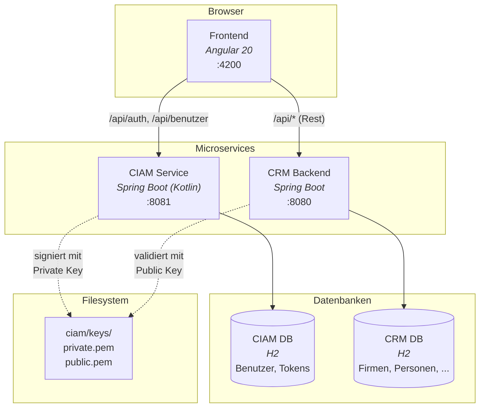
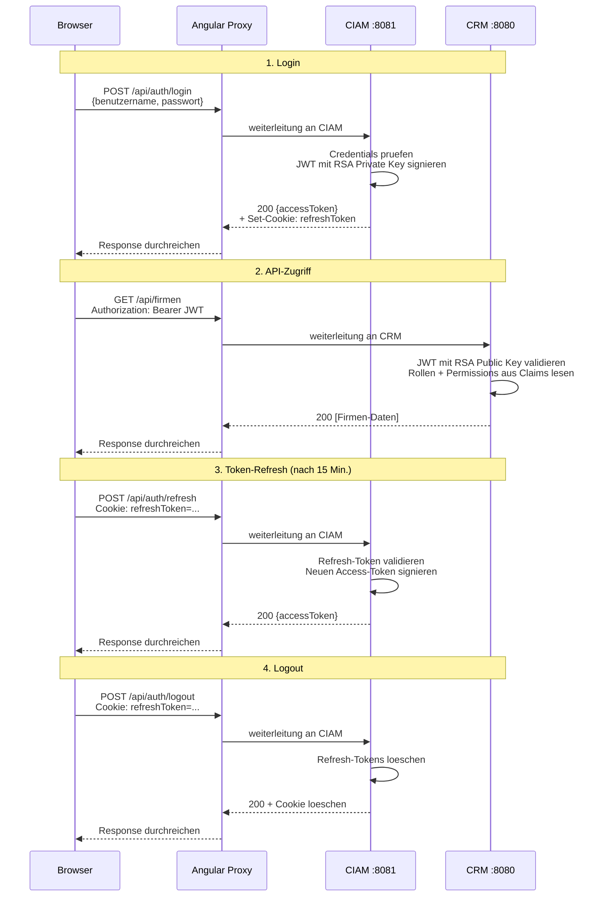
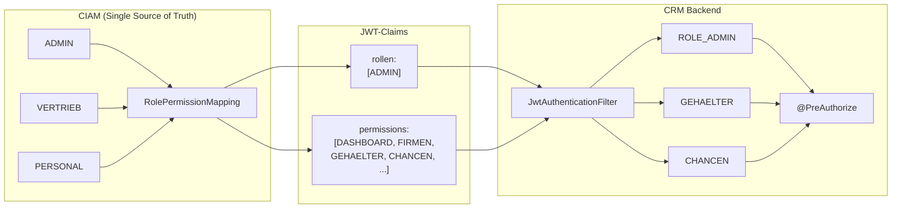
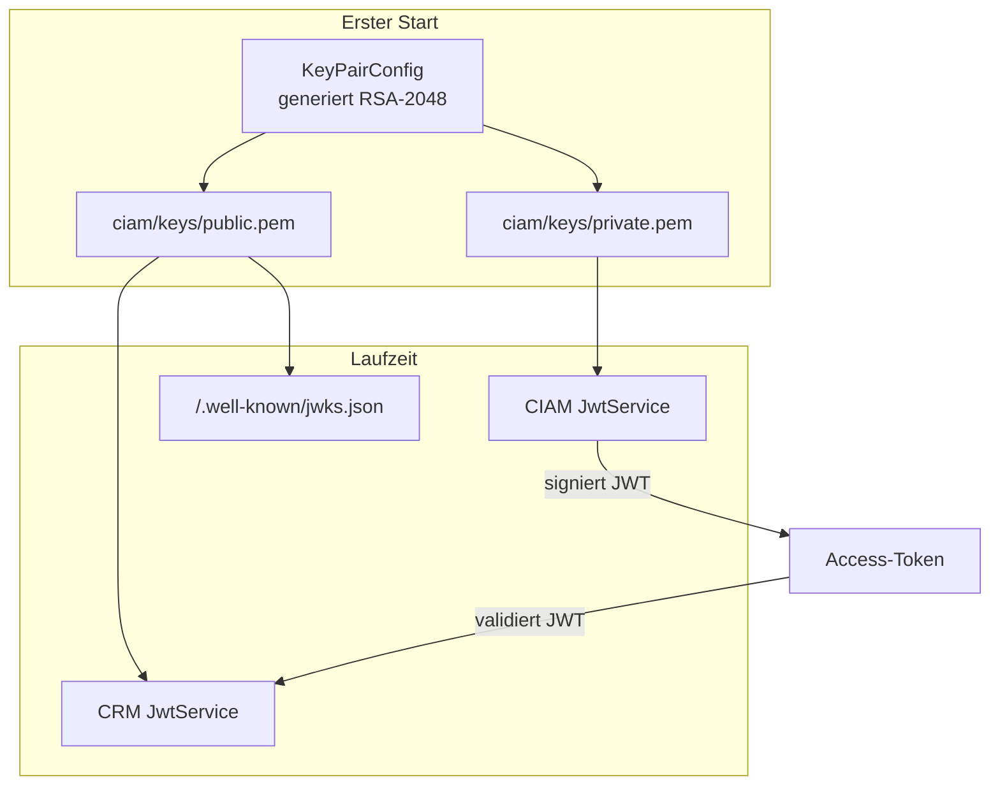
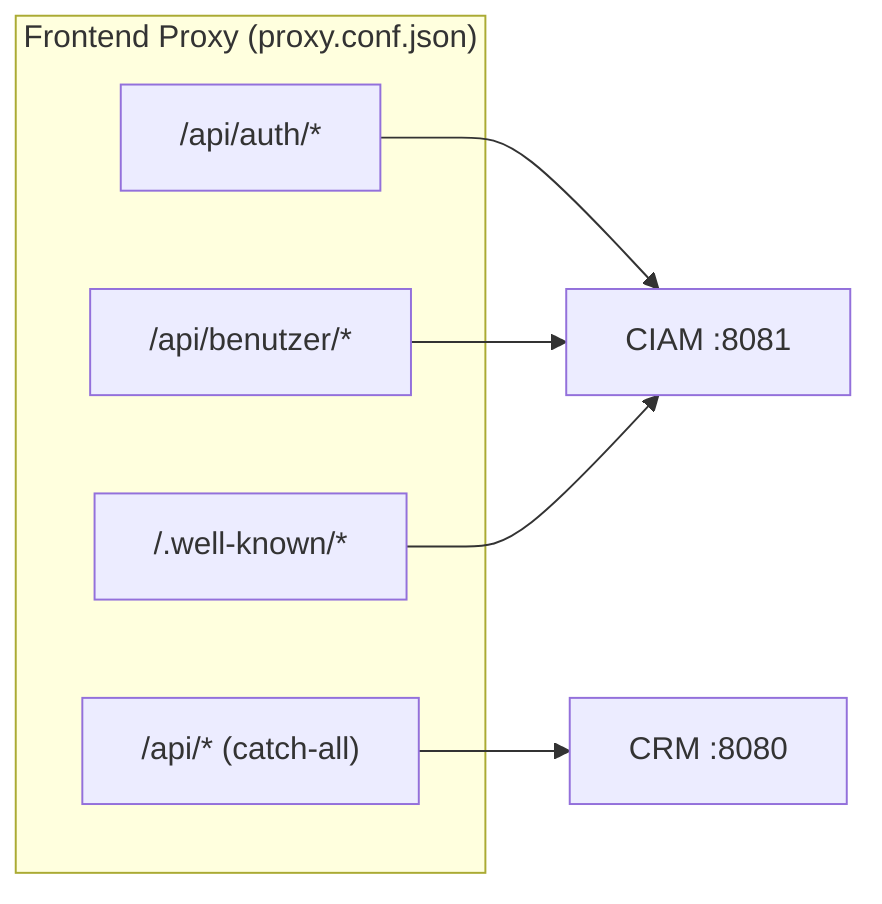
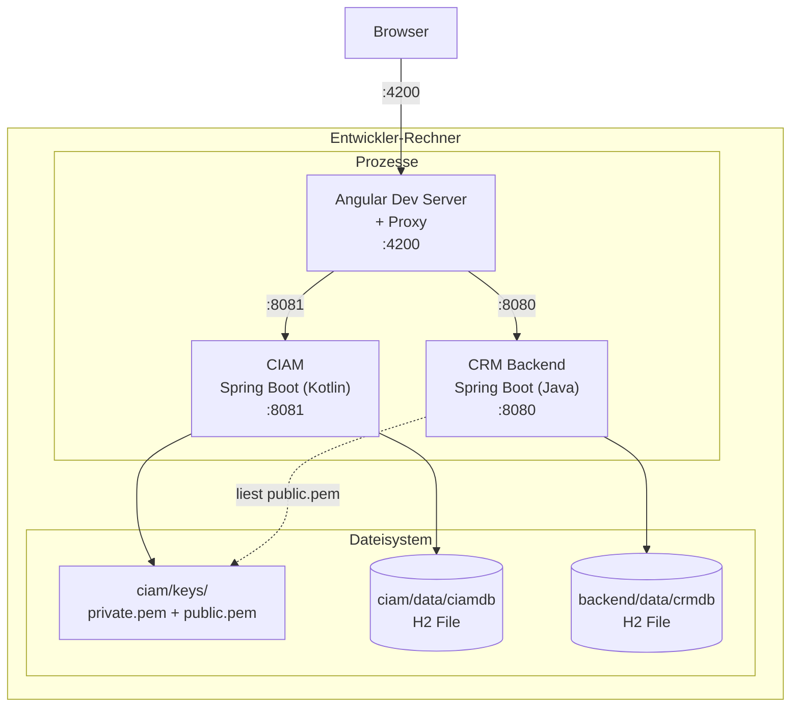
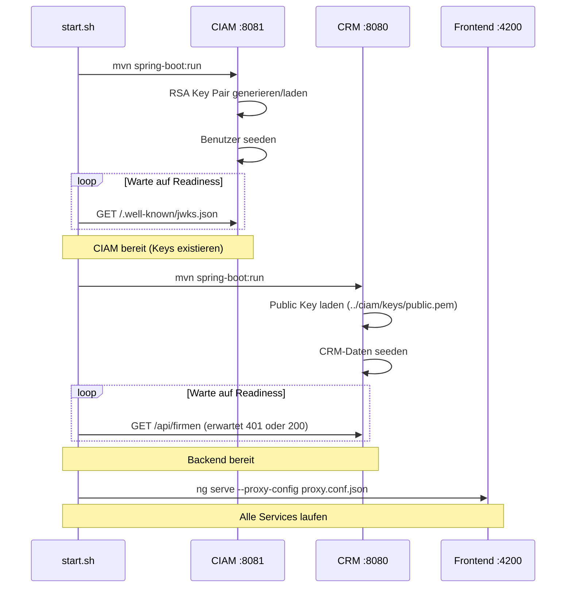
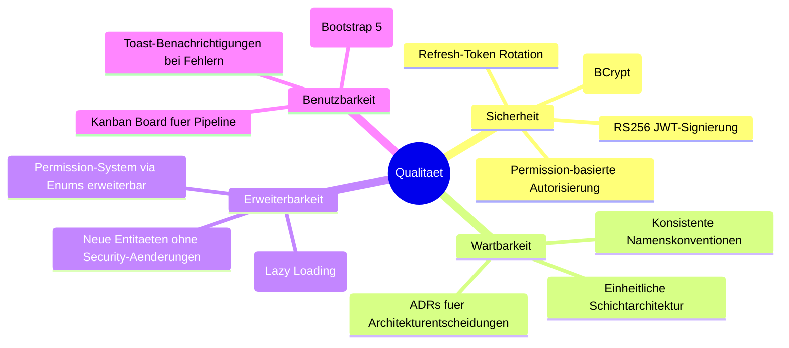

# Systemarchitektur

## Ziele & Stakeholder

### Fachliche Ziele

| Ziel | Beschreibung |
|---|---|
| Kundenbeziehungen verwalten | Firmen, Personen, Abteilungen und Adressen zentral pflegen |
| Vertriebspipeline steuern | Chancen (Opportunities) durch Phasen tracken, Umsatzprognosen ableiten |
| Vertraege & Gehaelter verwalten | Vertragshistorie und Gehaltsstrukturen pro Person fuehren |
| Aktivitaeten protokollieren | Anrufe, E-Mails, Meetings und Aufgaben als Timeline erfassen |
| Auswertungen erstellen | Konfigurierbare Reports ueber alle Entitaeten |

### Qualitaetsziele

| Prioritaet | Qualitaetsziel | Beschreibung |
|:---:|---|---|
| 1 | Sicherheit | Strikte Authentifizierung (RS256 JWT) und feingranulare Autorisierung (Permission-basiert) |
| 2 | Wartbarkeit | Klare Schichtentrennung, einheitliche Patterns (Entity → DTO → Mapper → Service → Controller) |
| 3 | Erweiterbarkeit | Neue Entitaeten und Permissions ohne Aenderungen an der Sicherheitsarchitektur hinzufuegbar |

### Stakeholder

| Rolle | Erwartung |
|---|---|
| Vertrieb | Firmen, Personen und Chancen effizient verwalten, Pipeline-Uebersicht (Kanban Board) |
| Personal | Gehaelter und Vertraege einsehen und verwalten |
| Admin | Benutzerverwaltung, vollstaendiger Systemzugriff |

## Randbedingungen

### Technische Randbedingungen

| Randbedingung | Hintergrund |
|---|---|
| Java 21 / Kotlin | Spring Boot 3.5.x erfordert mindestens Java 17, Projekt nutzt Java 21 |
| Spring Boot 3.5.3 | Backend-Framework fuer CRM und CIAM |
| Angular 20 | Frontend-Framework (Standalone Components, Signal-basiert) |
| H2 (file-based) | Eingebettete Datenbank, kein externer DB-Server noetig |
| Maven | Build-Tool fuer beide Spring Boot Services |

### Organisatorische Randbedingungen

| Randbedingung | Hintergrund |
|---|---|
| Lokale Entwicklung | Kein Docker/Kubernetes — alle Services laufen lokal via `start.sh` |
| Deutsches Domaenenmodell | Fachliche Begriffe (Firma, Person, Gehalt, Chance) auf Deutsch |
| Kein Flyway/Liquibase | Schema wird von Hibernate auto-generiert (`ddl-auto`) |

## Service-Uebersicht

Das System besteht aus drei Services:

## JWT-Authentifizierungsflow

## Permission-Modell

### Berechtigungsmatrix

| Permission | ADMIN | VERTRIEB | PERSONAL | Controller |
|---|:---:|:---:|:---:|---|
| DASHBOARD | x | x | x | DashboardController |
| FIRMEN | x | x | x | FirmaController |
| PERSONEN | x | x | x | PersonController |
| ABTEILUNGEN | x | x | x | AbteilungController |
| ADRESSEN | x | x | x | AdresseController |
| AKTIVITAETEN | x | x | x | AktivitaetController |
| GEHAELTER | x | | x | GehaltController |
| VERTRAEGE | x | x | | VertragController |
| CHANCEN | x | x | | ChanceController |
| BENUTZERVERWALTUNG | x | | | BenutzerController (CIAM) |

### Durchsetzung

Die Berechtigungsmatrix wird an **zwei Stellen** durchgesetzt:

1. **Backend** (`@PreAuthorize`): API-Endpoints pruefen `hasAuthority('GEHAELTER')` etc.
2. **Frontend** (Sidebar, Route Guards): UI-Elemente werden basierend auf Permissions ein-/ausgeblendet.

Die Permissions werden **nur im CIAM** definiert (`RolePermissionMapping`). Das CRM-Backend und das Frontend empfangen sie als JWT-Claims und setzen sie durch, ohne die Rolle-zu-Permission-Zuordnung selbst zu kennen.

## RSA Key Management

| Aspekt | Dev (aktuell) | Produktion (geplant) |
|---|---|---|
| Key-Verteilung | Filesystem (`../ciam/keys/public.pem`) | JWKS-Endpoint (`/.well-known/jwks.json`) |
| Key-Rotation | Manuell (Keys loeschen, CIAM neustarten) | Automatisch mit Key-ID im JWT-Header |
| Key-Speicherung | PEM-Dateien | Secret Manager / Vault |

## Proxy-Routing

Die Reihenfolge in `proxy.conf.json` ist entscheidend: Spezifische Pfade muessen **vor** dem Catch-All `/api` stehen, da der Angular Dev Server den ersten Match verwendet.

## Verteilungssicht

### Entwicklung (aktuell)

Alle drei Prozesse laufen auf demselben Rechner. `start.sh` orchestriert den Start in der richtigen Reihenfolge. Die H2-Datenbanken und RSA-Keys liegen im Dateisystem — kein externer Service noetig.

### Produktion (geplant)

| Aspekt | Dev (aktuell) | Produktion (geplant) |
|---|---|---|
| Datenbank | H2 file-based | PostgreSQL |
| Key-Verteilung | Dateisystem (`../ciam/keys/`) | Secret Manager / Vault |
| Key-Rotation | Manuell (Keys loeschen, neustarten) | Automatisch via JWKS + Key-ID |
| Frontend | Angular Dev Server mit Proxy | Nginx mit statischen Assets |
| Service Discovery | Feste Ports (8080, 8081) | Service Registry oder Reverse Proxy |

## Startup-Reihenfolge

## Qualitaetsanforderungen

### Qualitaetsszenarien

| ID | Qualitaetsziel | Szenario | Massnahme |
|---|---|---|---|
| Q1 | Sicherheit | Ein Benutzer ohne `GEHAELTER`-Permission ruft `/api/gehaelter` auf | `@PreAuthorize` lehnt mit 403 ab |
| Q2 | Sicherheit | Ein JWT wird manipuliert | RSA-Signaturpruefung schlaegt fehl → 401 |
| Q3 | Wartbarkeit | Neue Entitaet "Projekt" soll hinzugefuegt werden | 7 Backend-Dateien + 8 Frontend-Dateien nach dokumentiertem Pattern |
| Q4 | Erweiterbarkeit | Neue Permission "PROJEKTE" wird benoetigt | Enum-Eintrag in CIAM + Rollen-Mapping, kein Code-Change in CRM |
| Q5 | Benutzbarkeit | Vertrieb will Chancen zwischen Phasen verschieben | Drag & Drop im Kanban Board mit optimistischem Update |

## Risiken & Technische Schulden

| # | Risiko / Schuld | Auswirkung | Gegenmassnahme |
|---|---|---|---|
| R1 | H2 als Datenbank | Nicht produktionsgeeignet, keine Concurrency | Migration auf PostgreSQL vor Produktivbetrieb |
| R2 | Key-Verteilung ueber Dateisystem | Funktioniert nur auf einem Rechner | JWKS-Endpoint ist vorbereitet (`/.well-known/jwks.json`) |
| R3 | Kein DB-Migrationstools | Schema-Aenderungen koennen Daten verlieren (`ddl-auto`) | Flyway/Liquibase einfuehren vor Produktivbetrieb |
| R4 | Kein Health-Check / Monitoring | Ausfaelle werden nicht erkannt | Spring Actuator aktivieren |
| R5 | Keine Container-Orchestrierung | Manueller Start via `start.sh` | Docker Compose als naechster Schritt |
| R6 | Hibernate `open-in-view=false` | Lazy-Loading-Fehler bei vergessener `@Transactional` | Code-Convention in CLAUDE.md dokumentiert |

## Glossar

| Begriff (DE) | Uebersetzung (EN) | Beschreibung |
|---|---|---|
| **Firma** | Company | Kundenfirma mit Kontaktdaten, zentrales Objekt im CRM |
| **Person** | Contact/Person | Ansprechpartner innerhalb einer Firma |
| **Abteilung** | Department | Organisationseinheit einer Firma |
| **Adresse** | Address | Standort einer Firma oder Person |
| **Gehalt** | Salary | Gehaltseintrag einer Person (Grundgehalt, Bonus, Provision, Sonderzahlung) |
| **Aktivitaet** | Activity | Protokollierte Interaktion (Anruf, E-Mail, Meeting, Notiz, Aufgabe) |
| **Vertrag** | Contract | Vereinbarung mit einer Firma (Entwurf → Aktiv → Abgelaufen/Gekuendigt) |
| **Chance** | Opportunity | Verkaufschance im Pipeline-Prozess (Neu → Qualifiziert → Angebot → Verhandlung → Gewonnen/Verloren) |
| **Benutzer** | User | Systembenutzer, verwaltet im CIAM-Service |
| **Rolle** | Role | Berechtigungsgruppe (Admin, Vertrieb, Personal) |
| **Permission** | Permission | Feingranulare Berechtigung, abgeleitet aus Rolle |
| **CIAM** | Customer IAM | Identity & Access Management Microservice |
| **Auswertung** | Report | Konfigurierbarer Report ueber CRM-Daten |
| **Dashboard** | Dashboard | Benutzerspezifische Startseite mit konfigurierbaren Widgets |
