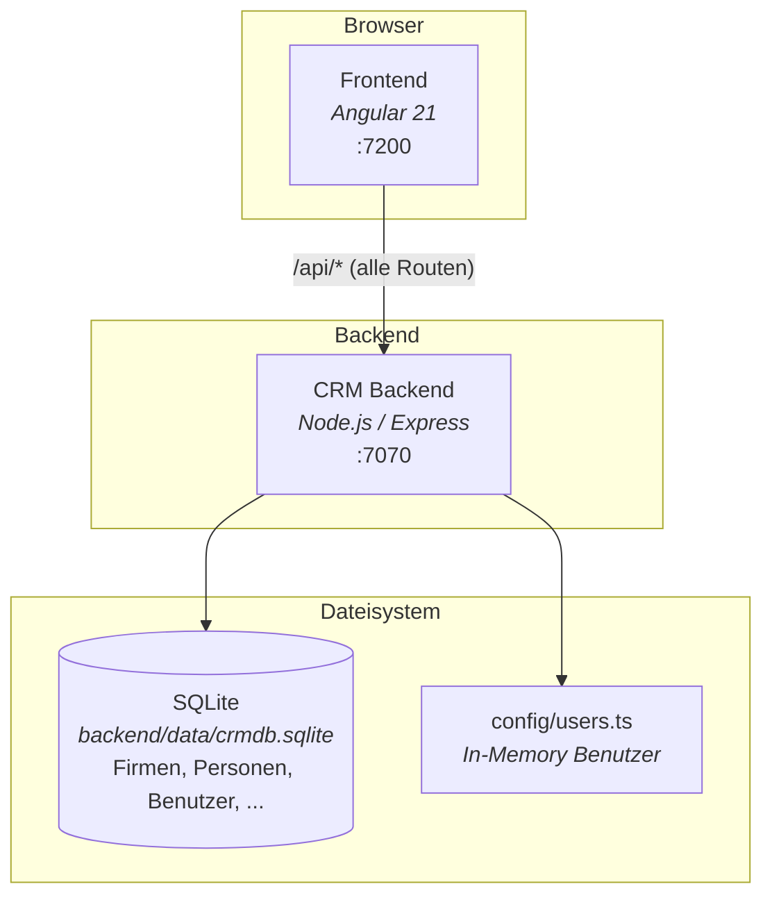
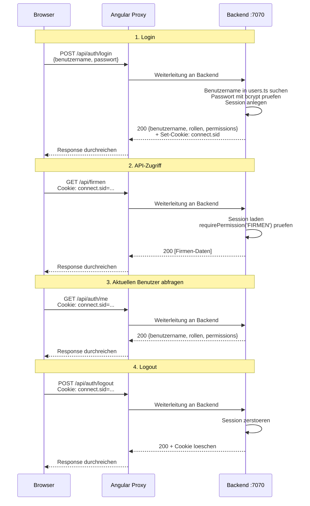
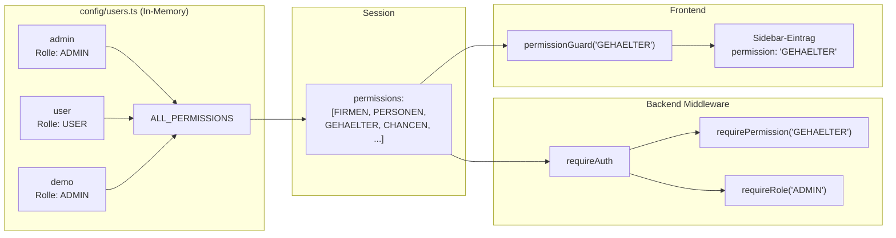
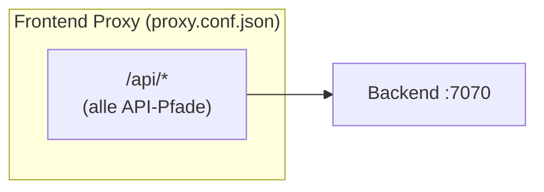
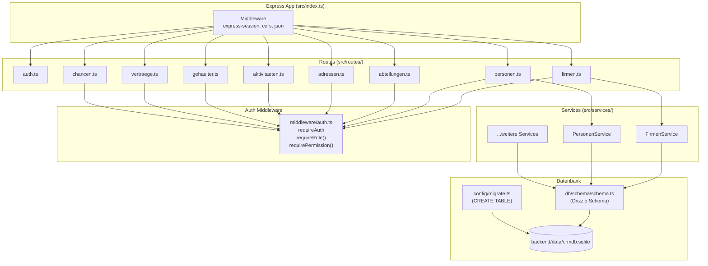
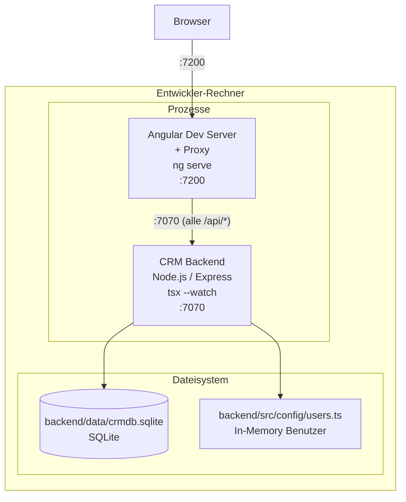
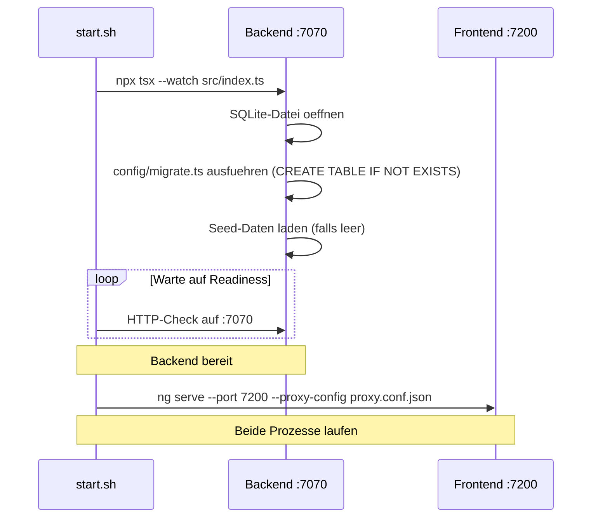
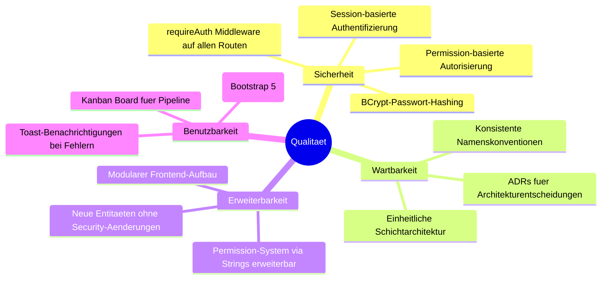

# Systemarchitektur

## Ziele & Stakeholder

### Fachliche Ziele

| Ziel | Beschreibung |
|---|---|
| Kundenbeziehungen verwalten | Firmen, Personen, Abteilungen und Adressen zentral pflegen |
| Vertriebspipeline steuern | Chancen (Opportunities) durch Phasen tracken, Umsatzprognosen ableiten |
| Vertraege & Gehaelter verwalten | Vertragshistorie und Gehaltsstrukturen pro Person fuehren |
| Aktivitaeten protokollieren | Anrufe, E-Mails, Meetings und Aufgaben als Timeline erfassen |
| Auswertungen erstellen | Konfigurierbare Reports ueber alle Entitaeten |

### Qualitaetsziele

| Prioritaet | Qualitaetsziel | Beschreibung |
|:---:|---|---|
| 1 | Sicherheit | Session-basierte Authentifizierung und permission-basierte Autorisierung |
| 2 | Wartbarkeit | Klare Schichtentrennung, einheitliche Patterns (Schema → Service → Route) |
| 3 | Erweiterbarkeit | Neue Entitaeten und Permissions ohne Aenderungen an der Sicherheitsarchitektur hinzufuegbar |

### Stakeholder

| Rolle | Erwartung |
|---|---|
| Vertrieb | Firmen, Personen und Chancen effizient verwalten, Pipeline-Uebersicht (Kanban Board) |
| Personal | Gehaelter und Vertraege einsehen und verwalten |
| Admin | Benutzerverwaltung, vollstaendiger Systemzugriff |

## Randbedingungen

### Technische Randbedingungen

| Randbedingung | Hintergrund |
|---|---|
| Node.js 20.19+ | Mindestversion, wird von `start.sh` geprueft |
| TypeScript | Sprache fuer Backend und Typdefinitionen |
| Express 4.21 | HTTP-Framework fuer das Backend |
| Angular 21 | Frontend-Framework (Standalone Components) |
| SQLite (better-sqlite3) | Eingebettete Datenbank, kein externer DB-Server noetig |
| Drizzle ORM | Type-safe ORM fuer Datenbankzugriff und Schema-Definition |

### Organisatorische Randbedingungen

| Randbedingung | Hintergrund |
|---|---|
| Lokale Entwicklung | Kein Docker/Kubernetes — beide Prozesse laufen lokal via `start.sh` |
| Deutsches Domaenenmodell | Fachliche Begriffe (Firma, Person, Gehalt, Chance) auf Deutsch |
| Kein Migrationstool | Schema wird per Custom-Skript in `config/migrate.ts` erstellt |

## System-Uebersicht

Das System besteht aus zwei Prozessen: einem Backend und einem Frontend.



## Session-Authentifizierungsflow



## Permission-Modell



### Benutzer & Berechtigungen

| Benutzername | Passwort | Rolle | Permissions |
|---|---|---|---|
| admin | admin123 | ADMIN | Alle |
| user | test123 | USER | Alle |
| demo | demo1234 | ADMIN | Alle |

Alle drei Benutzer haben derzeit `ALL_PERMISSIONS`. Die Passwort-Hashes sind per bcrypt (Cost 10) vorab generiert und in `config/users.ts` hartcodiert.

### Berechtigungsmatrix

| Permission | admin | user | demo | Route-Middleware |
|---|:---:|:---:|:---:|---|
| FIRMEN | x | x | x | `requirePermission('FIRMEN')` |
| PERSONEN | x | x | x | `requirePermission('PERSONEN')` |
| ABTEILUNGEN | x | x | x | `requirePermission('ABTEILUNGEN')` |
| ADRESSEN | x | x | x | `requirePermission('ADRESSEN')` |
| AKTIVITAETEN | x | x | x | `requirePermission('AKTIVITAETEN')` |
| GEHAELTER | x | x | x | `requirePermission('GEHAELTER')` |
| VERTRAEGE | x | x | x | `requirePermission('VERTRAEGE')` |
| CHANCEN | x | x | x | `requirePermission('CHANCEN')` |
| BENUTZERVERWALTUNG | x | x | x | `requirePermission('BENUTZERVERWALTUNG')` |

### Durchsetzung

Die Berechtigungsmatrix wird an **zwei Stellen** durchgesetzt:

1. **Backend** (`requirePermission()`): API-Endpoints pruefen die Permission in `middleware/auth.ts`.
2. **Frontend** (Sidebar, Route Guards): UI-Elemente werden basierend auf Permissions ein-/ausgeblendet.

Die Permissions sind direkt am Benutzer-Objekt in `config/users.ts` gespeichert. Das Backend liest sie aus der Session. Das Frontend empfaengt sie per `GET /api/auth/me`.

## Proxy-Routing



Eine einzige Proxy-Regel leitet alle `/api`-Pfade an das Backend weiter. Kein Split-Routing noetig, da es nur einen Backend-Prozess gibt.

## Backend-Architektur



Jede Route-Datei erzwingt Authentifizierung und Autorisierung via Middleware. Danach delegiert sie an einen Service, der Drizzle-Queries ausfuehrt.

## Paginierung

Das Backend gibt Listenendpunkte im Spring Data Page Format zurueck. Das Frontend erwartet dieses Format.

```
{
  content: [...],
  totalElements: 150,
  totalPages: 15,
  size: 10,
  number: 0,      // 0-indiziert
  first: true,
  last: false
}
```

Wichtig: NgbPagination im Frontend ist 1-indiziert. Service-Aufrufe rechnen mit `this.currentPage - 1` um.

## Verteilungssicht

### Entwicklung (aktuell)



Beide Prozesse laufen auf demselben Rechner. `start.sh` startet Backend und Frontend in der richtigen Reihenfolge. Die SQLite-Datei liegt im Dateisystem — kein externer Service noetig.

### Produktion (geplant)

| Aspekt | Dev (aktuell) | Produktion (geplant) |
|---|---|---|
| Datenbank | SQLite file-based | PostgreSQL |
| Benutzer | Hartcodiert in `config/users.ts` | Datenbank-gestuetzte Benutzerverwaltung |
| Frontend | Angular Dev Server mit Proxy | Nginx mit statischen Assets |
| Prozessstart | Manuell via `start.sh` | Docker Compose oder Systemd |

## Startup-Reihenfolge



## Qualitaetsanforderungen



### Qualitaetsszenarien

| ID | Qualitaetsziel | Szenario | Massnahme |
|---|---|---|---|
| Q1 | Sicherheit | Ein Benutzer ohne `GEHAELTER`-Permission ruft `/api/gehaelter` auf | `requirePermission('GEHAELTER')` lehnt mit 403 ab |
| Q2 | Sicherheit | Ein nicht eingeloggter Benutzer ruft eine API auf | `requireAuth` lehnt mit 401 ab |
| Q3 | Wartbarkeit | Neue Entitaet "Projekt" soll hinzugefuegt werden | 3 Backend-Dateien + 8 Frontend-Dateien nach dokumentiertem Pattern |
| Q4 | Erweiterbarkeit | Neue Permission "PROJEKTE" wird benoetigt | String in `ALL_PERMISSIONS` + `requirePermission()` auf Route + `permissionGuard()` im Frontend |
| Q5 | Benutzbarkeit | Vertrieb will Chancen zwischen Phasen verschieben | Drag & Drop im Kanban Board mit optimistischem Update |

## Risiken & Technische Schulden

| # | Risiko / Schuld | Auswirkung | Gegenmassnahme |
|---|---|---|---|
| R1 | SQLite als Datenbank | Begrenzte Concurrency, nicht fuer hohe Last geeignet | Migration auf PostgreSQL vor Produktivbetrieb |
| R2 | Benutzer hartcodiert in `config/users.ts` | Kein Self-Service, Passwortaenderung erfordert Code-Aenderung | Datenbank-gestuetzte Benutzerverwaltung einfuehren |
| R3 | Kein DB-Migrationstool | Schema-Aenderungen koennen Daten verlieren | Drizzle-Migrations oder Flyway einfuehren |
| R4 | Kein Health-Check / Monitoring | Ausfaelle werden nicht erkannt | Health-Endpoint und Logging ergaenzen |
| R5 | Keine Container-Orchestrierung | Manueller Start via `start.sh` | Docker Compose als naechster Schritt |
| R6 | Session-Speicher im Prozess-Memory | Sessions gehen bei Neustart verloren | Redis-Session-Store fuer Produktion |

## Glossar

### Domaenenbegriffe

| Begriff (DE) | Uebersetzung (EN) | Beschreibung |
|---|---|---|
| **Firma** | Company | Kundenfirma mit Kontaktdaten, zentrales Objekt im CRM |
| **Person** | Contact/Person | Ansprechpartner innerhalb einer Firma |
| **Abteilung** | Department | Organisationseinheit einer Firma |
| **Adresse** | Address | Standort einer Firma oder Person |
| **Gehalt** | Salary | Gehaltseintrag einer Person (Grundgehalt, Bonus, Provision, Sonderzahlung) |
| **Aktivitaet** | Activity | Protokollierte Interaktion (Anruf, E-Mail, Meeting, Notiz, Aufgabe) |
| **Vertrag** | Contract | Vereinbarung mit einer Firma (Entwurf → Aktiv → Abgelaufen/Gekuendigt) |
| **Chance** | Opportunity | Verkaufschance im Pipeline-Prozess (Neu → Qualifiziert → Angebot → Verhandlung → Gewonnen/Verloren) |
| **Auswertung** | Report | Konfigurierbarer Report ueber CRM-Daten |
| **Dashboard** | Dashboard | Benutzerspezifische Startseite mit konfigurierbaren Widgets |

### Technologiebegriffe

| Begriff | Beschreibung |
|---|---|
| **Drizzle ORM** | Type-safe ORM fuer Node.js. Schema in TypeScript, Queries als Builder. |
| **better-sqlite3** | Synchrones SQLite-Treiber-Paket fuer Node.js |
| **express-session** | Session-Middleware fuer Express. Speichert Session-ID als Cookie `connect.sid`. |
| **bcryptjs** | Passwort-Hashing-Bibliothek. Cost-Faktor 10 fuer vorab generierte Hashes. |
| **tsx --watch** | TypeScript-Ausfuehrung mit Hot Reload fuer den Backend-Entwicklungsmodus |
| **Zod** | Schema-Validierungsbibliothek fuer Request-Daten im Backend |
| **Permission** | Feingranulare Berechtigung als String (z. B. `FIRMEN`, `GEHAELTER`) |
| **Rolle** | Berechtigungsgruppe eines Benutzers (`ADMIN`, `USER`) |
| **Session** | Server-seitiger Zustand nach Login, referenziert per Cookie im Browser |
