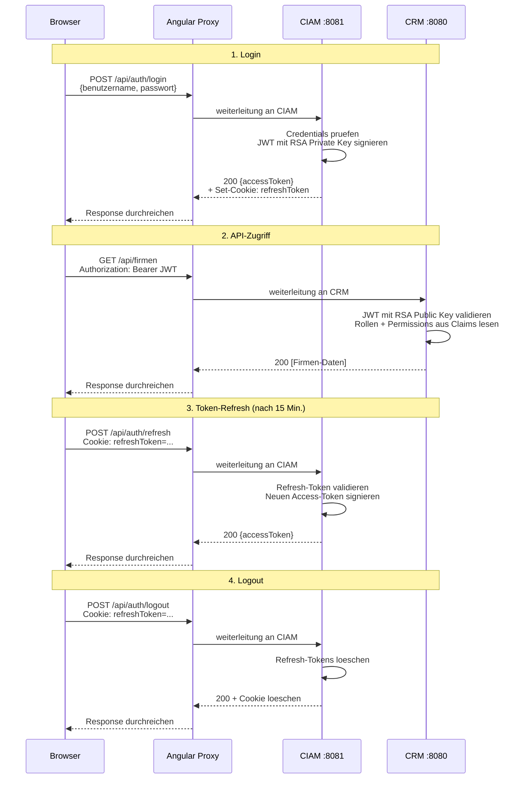
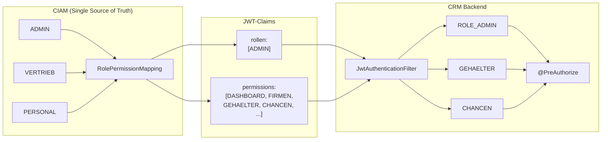
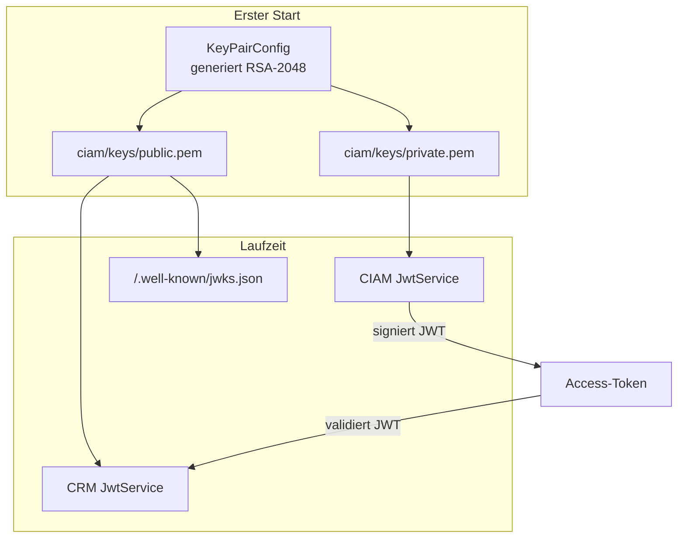
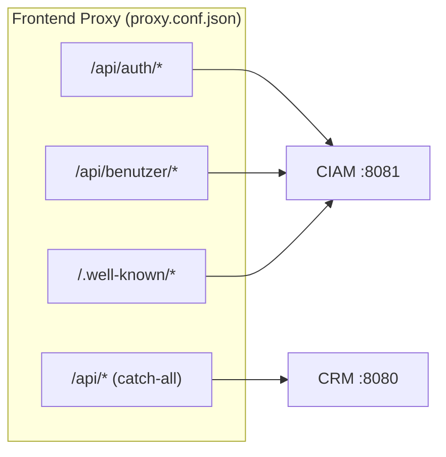
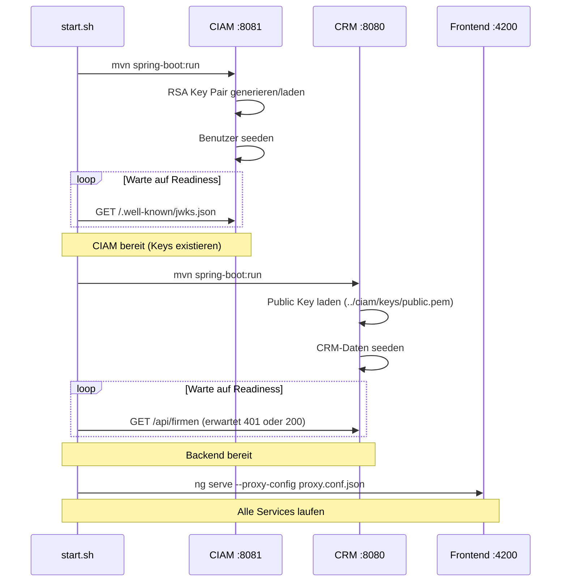

# Systemarchitektur

## Service-Uebersicht

Das System besteht aus drei Services:

## JWT-Authentifizierungsflow

## Permission-Modell

### Berechtigungsmatrix

| Permission | ADMIN | VERTRIEB | PERSONAL | Controller |
|---|:---:|:---:|:---:|---|
| DASHBOARD | x | x | x | DashboardController |
| FIRMEN | x | x | x | FirmaController |
| PERSONEN | x | x | x | PersonController |
| ABTEILUNGEN | x | x | x | AbteilungController |
| ADRESSEN | x | x | x | AdresseController |
| AKTIVITAETEN | x | x | x | AktivitaetController |
| GEHAELTER | x | | x | GehaltController |
| VERTRAEGE | x | x | | VertragController |
| CHANCEN | x | x | | ChanceController |
| BENUTZERVERWALTUNG | x | | | BenutzerController (CIAM) |

### Durchsetzung

Die Berechtigungsmatrix wird an **zwei Stellen** durchgesetzt:

1. **Backend** (`@PreAuthorize`): API-Endpoints pruefen `hasAuthority('GEHAELTER')` etc.
2. **Frontend** (Sidebar, Route Guards): UI-Elemente werden basierend auf Permissions ein-/ausgeblendet.

Die Permissions werden **nur im CIAM** definiert (`RolePermissionMapping`). Das CRM-Backend und das Frontend empfangen sie als JWT-Claims und setzen sie durch, ohne die Rolle-zu-Permission-Zuordnung selbst zu kennen.

## RSA Key Management

| Aspekt | Dev (aktuell) | Produktion (geplant) |
|---|---|---|
| Key-Verteilung | Filesystem (`../ciam/keys/public.pem`) | JWKS-Endpoint (`/.well-known/jwks.json`) |
| Key-Rotation | Manuell (Keys loeschen, CIAM neustarten) | Automatisch mit Key-ID im JWT-Header |
| Key-Speicherung | PEM-Dateien | Secret Manager / Vault |

## Proxy-Routing

Die Reihenfolge in `proxy.conf.json` ist entscheidend: Spezifische Pfade muessen **vor** dem Catch-All `/api` stehen, da der Angular Dev Server den ersten Match verwendet.

## Startup-Reihenfolge

